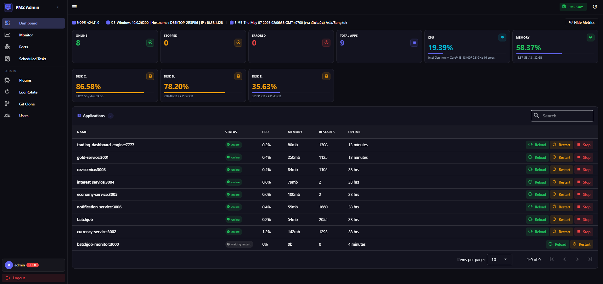

# PM2 Admin

A modern, secure web interface for managing PM2 processes. Runs on **Linux** and **Windows** (including Windows Server). A self-hosted alternative to PM2 Plus.



## Features

- **Process Dashboard** — View status, CPU, memory, uptime, and restarts for all PM2 apps at a glance. PM2 plugin processes are filtered into a separate Plugins page.
- **Process Control** — Reload, Restart (with optional rename), Stop, and Delete processes.
- **Log Viewer** — Browse stdout/stderr logs per app with color-coded log levels; reload log on demand; download raw log files (root only).
- **Environment Management** — View, edit, and back up `.env` files per app (root only). Values are hidden by default with a show/hide toggle.
- **Git Integration** — Clone new repositories and start them as PM2 processes; pull updates for running apps.
- **Server Monitor** — Live CPU/RAM/Disk charts and top processes list.
- **Listening Ports** — See which TCP ports are in use and which are mapped to PM2-managed apps.
- **Scheduled Tasks** — View crontab entries (Linux) or Task Scheduler jobs (Windows) (root only).
- **Shared Folders** — View Samba/NFS shares (Linux) or network shares (Windows) (root only).
- **Plugins** — Dedicated view for PM2 module processes with restart control (restart is disabled for `pm2-admin` itself).
- **Log Rotate** — Configure [pm2-logrotate](https://github.com/keymetrics/pm2-logrotate) settings via a UI form.
- **User Management** — Create and manage users with role-based access.
- **HTTP / HTTPS** — Run the server in plain HTTP or TLS mode via `.env` config.
- **Dark UI** — Vue 3 + Vuetify 3 with a clean dark theme.

## Roles

| Capability | Root | User |
|---|---|---|
| View dashboard, app list, ports, server monitor | ✓ | ✓ |
| View app logs (in UI) | ✓ | ✓ |
| Reload / Restart / Stop / Delete apps | ✓ | — |
| Download log files | ✓ | — |
| Edit `.env` files | ✓ | — |
| Git clone / Git pull | ✓ | — |
| View scheduled tasks and shared folders | ✓ | — |
| Plugins — restart PM2 modules | ✓ | — |
| Log Rotate configuration | ✓ | — |
| User management | ✓ | — |
| Change own password | ✓ | — |

## Prerequisites

- **OS**: Linux (Ubuntu, Debian, RHEL, etc.) or Windows 10 / 11 / Server 2016+
- **Node.js**: v16+
- **PM2**: `npm install -g pm2`
- **Git**: required for Git clone / Git pull features

## Installation

### Linux / macOS

```bash
git clone https://github.com/artapon/pm2-admin.git
cd pm2-admin

# 1. Install all dependencies + create .env
scripts/install.sh

# 2. Edit .env if needed (HOST, PORT, APP_SESSION_SECRET)
nano .env

# 3. Build the frontend
scripts/build.sh

# 4a. Start in the foreground (dev / quick test)
scripts/start.sh

# 4b. Or deploy as a persistent PM2 service (production)
scripts/install-pm2-prd.sh
```

### Windows

```bat
scripts\install.bat
scripts\build.bat
scripts\start.bat
:: or for a persistent Windows Service (run as Administrator):
scripts\install-pm2-prd.bat
```

### Manual (any platform)

```bash
npm install
npm run build    # builds src/frontend/dist via Vite
npm start        # node src/app.js
```

Visit `http://localhost:4343`. On first run you will be redirected to the **Setup** page to create the initial root account.

## Scripts

All scripts live in the `scripts/` folder. Each operation has a matching Unix and Windows version:

| Purpose | Linux / macOS | Windows |
|---|---|---|
| Install all dependencies + create `.env` | `scripts/install.sh` | `scripts\install.bat` |
| Build the Vue frontend | `scripts/build.sh` | `scripts\build.bat` |
| Start (PM2 if available, else foreground) | `scripts/start.sh` | `scripts\start.bat` |
| Deploy as a persistent service (production) | `scripts/install-pm2-prd.sh` | `scripts\install-pm2-prd.bat` |

**Windows production** (`scripts\install-pm2-prd.bat`) uses [NSSM](https://nssm.cc) to wrap the PM2 daemon as a Windows Service so all managed processes survive reboots. Place `nssm-2.24.zip` in the project root folder before running, or pre-install `nssm.exe` to `C:\nssm\nssm.exe`.

## Configuration

The `scripts/install.sh` / `scripts/install.bat` scripts create `.env` from `.env.example` automatically. To configure manually:

```bash
cp .env.example .env   # Linux / macOS
copy .env.example .env  # Windows
```

| Variable | Default | Description |
|---|---|---|
| `HOST` | `127.0.0.1` | Bind address |
| `PORT` | `4343` | Listening port |
| `APP_SESSION_SECRET` | *(auto-generated)* | Session signing secret — set explicitly for stability across restarts |
| `NODE_ENV` | — | Set to `production` to enable `Secure` cookies and HSTS |
| `FORCE_HTTPS` | — | Set to `true` to enable `Secure` cookies and HSTS when behind a TLS-terminating proxy without `NODE_ENV=production` |
| `APP_HTTP_MODE` | `HTTP` | Set to `HTTPS` to enable TLS — the server reads the cert files below and starts on the configured port |
| `CERT_KEY` | `cert.key` | Path to the TLS private key file (relative to project root, or absolute) |
| `CERT_PATH` | `cert.crt` | Path to the TLS certificate file (relative to project root, or absolute) |
| `APP_ENV` | `Production` | Environment label shown in the UI |

> **Note:** The app sets `trust proxy: 1`. Deploy behind exactly one reverse proxy (nginx, Caddy, etc.) for correct IP-based rate limiting and secure cookies over HTTPS.

### Enabling HTTPS

1. Place your certificate files in the project root (or point to absolute paths):
   ```
   cert.key   ← private key
   cert.crt   ← certificate (or full chain)
   ```
2. Update `.env`:
   ```
   APP_HTTP_MODE=HTTPS
   CERT_KEY=cert.key
   CERT_PATH=cert.crt
   ```
3. Restart the app. The server will start on `https://HOST:PORT`. Secure cookies and HSTS are enabled automatically.

To generate a self-signed certificate for local testing:
```bash
openssl req -x509 -newkey rsa:4096 -keyout cert.key -out cert.crt -days 365 -nodes -subj "/CN=localhost"
```

## Log Rotate

If [pm2-logrotate](https://github.com/keymetrics/pm2-logrotate) is installed (`pm2 install pm2-logrotate`), the **ADMIN > Log Rotate** page lets you configure it from the UI:

| Setting | Default | Description |
|---|---|---|
| Max Size | `1G` | File size that triggers rotation |
| Retain | `3` | Number of rotated files to keep |
| Rotate Interval | `0 0 1 * *` | Cron schedule (default: 1st of each month) |
| Worker Interval | `30` | Seconds between size checks |
| Date Format | `YYYY-MM-DD_HH-mm-ss` | Rotated file name pattern |
| Timezone | *(system)* | IANA timezone for timestamps |
| Compress | off | Gzip rotated files |
| Rotate Module Logs | on | Include PM2 module logs |

## Platform compatibility

The app detects the host OS at runtime and adjusts behavior automatically:

| Feature | Linux | Windows |
|---|---|---|
| Scheduled Tasks | reads `crontab -l` | reads `schtasks /query` |
| Shared Folders | Samba (`smbstatus`) + NFS (`exportfs`) | `net share` |
| Shell execution | POSIX `execFile` | `cmd.exe /c` wrapper — no shell interpolation of user input |
| Current user env var | `$USER` | `%USERNAME%` |

## Tech Stack

**Backend**
- Node.js + Express 4
- `better-sqlite3` — user/session storage
- `express-session` — session management
- `bcryptjs` — password hashing
- `helmet` — security headers (CSP, HSTS, COOP, X-Frame-Options, etc.)
- `express-rate-limit` — rate limiting on auth, git, and write endpoints
- `ansi-to-html` — ANSI color code rendering in log viewer
- `systeminformation` — OS/hardware metrics
- `pm2` — programmatic process control

**Frontend**
- Vue 3 (Composition API) + Vite
- Vuetify 3 + Material Design Icons
- Pinia — state management
- Vue Router 4
- Chart.js + vue-chartjs — live monitoring charts
- Axios — HTTP client

## Security

- **Passwords** hashed with bcrypt (12 rounds)
- **Sessions** stored in SQLite; regenerated on login (prevents session fixation); destroyed on logout and password change
- **Session cookies**: `httpOnly`, `sameSite: strict`, 7-day rolling expiry; `secure` flag enabled in production and HTTPS mode
- **Security headers** via `helmet`: Content-Security-Policy, HSTS (production / HTTPS mode), X-Frame-Options, X-Content-Type-Options, Cross-Origin policies, Referrer-Policy
- **Rate limiting**: login 10 req / 15 min (failed attempts only); setup 5 req / 1 hr; password change 5 req / 15 min; git operations 10 req / 5 min; write actions 60 req / 1 min
- **Input validation**: app names, usernames, branch names, and node args are validated against strict allowlists before reaching PM2 or the filesystem
- **Command injection prevention**: all shell operations use argument vectors (`execFile`) — no string interpolation with user input; `net usershare info` and `pm2 set` are both protected
- **SQL injection prevention**: all database queries use parameterized prepared statements — no string interpolation in SQL
- **XSS prevention**: raw log content is HTML-entity-escaped and null-byte-stripped before ANSI conversion; Vue's template interpolation (`{{ }}`) auto-escapes all bound strings; no `v-html` directives used
- **Path traversal prevention**: git clone target validated with `path.relative`; log download paths confirmed to be inside the app's working directory
- **Sensitive data**: `.env` file contents are masked by default in the UI (show/hide toggle); log downloads, scheduled tasks, and shared folder info are restricted to root users only
- **API responses**: `Cache-Control: no-store` on all `/api/*` routes
- **User ID 1** (initial root) cannot be deleted
- **Generic auth errors**: login returns the same message for unknown user and wrong password (prevents username enumeration)
- **Git credentials**: redacted from all server-side logs; only `https://` URLs accepted for clone/pull

## License

MIT
